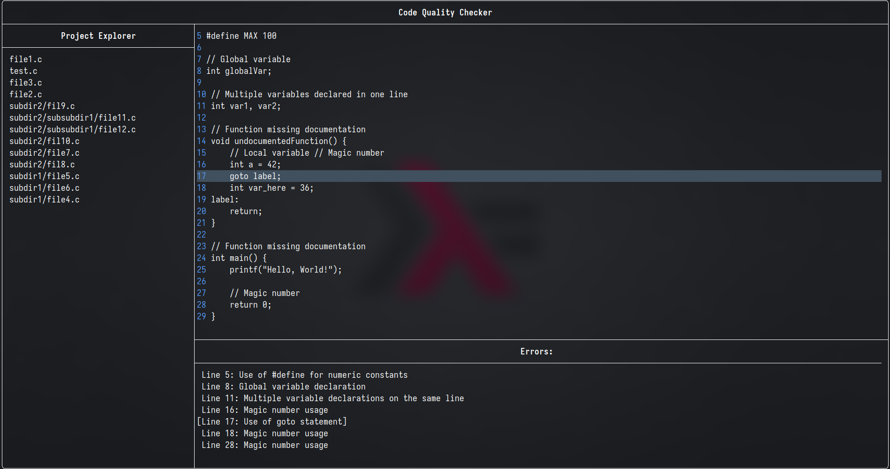

# Code Quality Checker

 <!-- Replace with the actual image file name -->

## Overview

Code Quality Checker is a terminal-based application designed to analyze C/C++ source files for code quality issues. Utilizing the [FTXUI library](https://github.com/ArthurSonzogni/ftxui), this project provides a user-friendly interface for displaying errors and warnings detected by a lexer. The application is built with modern C++ standards and aims to help developers maintain high-quality code.

## Features

- Analyze C/C++ source files for common code quality issues.
- Interactive terminal user interface built with FTXUI.
- Easy setup and build process using CMake.
- Supports error reporting and navigation through detected issues.

## Dependencies

This project depends on the following libraries and tools:

- [FTXUI](https://github.com/ArthurSonzogni/ftxui): A library for building terminal user interfaces.
- [nlohmann/json](https://github.com/nlohmann/json): A JSON library for C++.
- CMake: A cross-platform build system generator.
- Git: For version control and fetching dependencies.

## Build Instructions

To build the project, follow these steps:

1. **Clone the repository**:
   ```bash
   git clone https://github.com/Ruebled/CodeQualityChecker.git
   cd CodeQualityChecker
   ```

2. **Ensure you have the required dependencies**:
   - Install CMake and Git if they are not already installed. You can typically install them using your package manager. For example, on Ubuntu:
     ```bash
     sudo apt update
     sudo apt install cmake git
     ```

3. **Build the project**:
   - Make sure you are in the project directory where the `Makefile` is located. You can compile both the `cqc-tui` and `cqc-cli` projects by running:
     ```bash
     make
     ```
   - Alternatively, you can use:
     ```bash
     make all
     ```
   - This will compile both projects automatically.

4. **Run the application**:
   - After building, you can run the application with:
     ```bash
     make run
     ```
   - This command will execute the project using the files in the `test-proj` directory.

## Usage

Once the application is running, you can analyze C/C++ source files by providing the path to the file or directory as an argument. The terminal interface will display any detected errors or warnings, allowing you to navigate through them easily.

## License

This project is licensed under the MIT License. See the [LICENSE](LICENSE) file for more details.

## Contributing

Contributions are welcome! If you have suggestions for improvements or new features, please feel free to submit a pull request or open an issue.

## Acknowledgments

- Thanks to the [FTXUI](https://github.com/ArthurSonzogni/ftxui) team for their excellent library.
- Thanks to the [nlohmann/json](https://github.com/nlohmann/json) library for JSON handling in C++.
